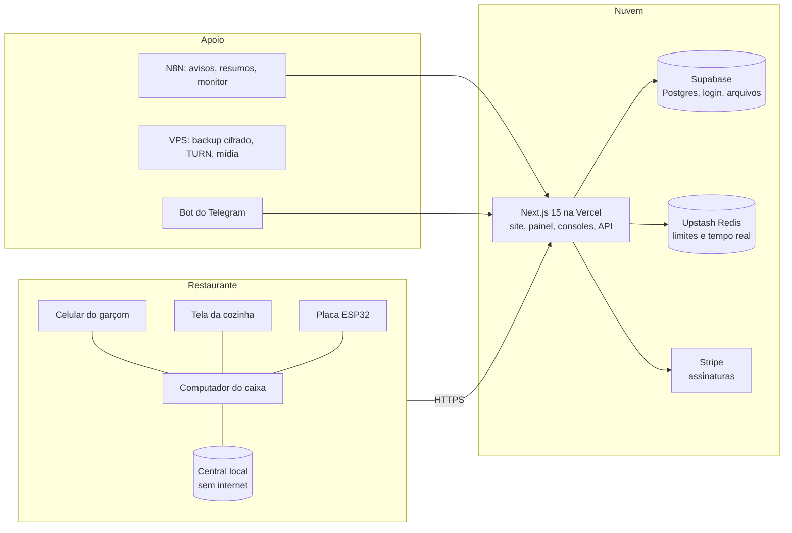

# Tempero PDV

**PDV e gestão para restaurantes, bares, cafés e redes.** Do salão à cozinha, do caixa ao financeiro e ao estoque,
com a equipe no celular e o restaurante funcionando mesmo quando a internet cai.

[O que faz](#o-que-o-tempero-pdv-faz) · [Em números](#em-números) · [Consoles](#plataforma-e-consoles) · [Apps](#apps-e-downloads) ·
[Arquitetura](#arquitetura) · [Segurança](#segurança-e-lgpd) · [Repositórios](#repositórios) · [Como trabalhamos](#como-trabalhamos)

---

### O que o Tempero PDV faz

O primeiro cliente é o **Pedacinho do Céu**, restaurante que opera com o sistema todos os dias. Tudo o que está aqui
nasceu de uma necessidade do salão, da cozinha ou do caixa de verdade.

| Salão | Produção | Caixa e gestão |
|---|---|---|
| Mesas em planta 2D e 3D com áreas (salão, varanda, deck, VIP), comandas, conta por pessoa, gorjeta e PIX dinâmico | Cozinha, bar e outros setores com tela (KDS) e impressora própria, tempo de preparo por prato e prioridade | Caixa com abertura, sangria, suprimento e fechamento conferido, resumo por e-mail ao dono |
| App do garçom no Android e no iPhone, cardápio digital com QR assinado e pedido pela mesa | Observação completa (sai primeiro, segurar, alergia) e via só com os itens novos | Histórico de comandas de qualquer dia, reimpressão, cupom por e-mail e estorno com motivo |
| Reservas, lista de espera e clientes (CRM) | Estoque com ficha técnica: o prato sem ingrediente é barrado antes do cozinheiro | Financeiro, DRE, relatórios, indicadores do dia e pacote do contador |
| Funciona sem internet: central local e fila que sincroniza depois | Reposição sugerida por fornecedor, validade dos lotes e CMV | Divisão dos 10% pela escala, folha da equipe e consumo com desconto |
| Rede de unidades com metas, cardápio igual e transferência de estoque | Placa ESP32 que liga a térmica no Wi-Fi, sem computador | NFC-e, impostos do Simples, Lei 12.741, marca própria e API |

### Em números

| | |
|---|---|
| **1.745** comandos no bot do Telegram do dono | **21** endpoints na API v2, com OpenAPI e coleção do Postman |
| **113** cursos na Tempero Academia, com aulas narradas e certificado | **2.342** respostas na central de ajuda |
| **1.089** artigos no blog | **25+** consoles e subdomínios da plataforma |
| **10** sistemas operacionais e aparelhos atendidos pelos apps | **7 dias** de teste grátis no nível Pro, reembolso em até 7 dias |

### Plataforma e consoles

Um projeto Next.js só, um subdomínio por sistema, login único entre eles e permissão por time em cada rota.

| Endereço | Para quem | O que é |
|---|---|---|
| [www.temperopdv.com.br](https://www.temperopdv.com.br) | público | site, planos, blog, ajuda, treinamentos, carreiras, downloads e demonstração |
| app.temperopdv.com.br | dono, gerente, caixa, garçom, cozinha, bar | painel do restaurante |
| apkapple.temperopdv.com.br | equipe do salão | app web instalável (iPhone e qualquer navegador) |
| admin. · suporte. · comercial. · mondayclient. | equipe da plataforma | administração, chamados, marketing e CRM |
| financeiro. · seguranca. · cofre. · infra. · qa. | equipe da plataforma | finanças, segurança/LGPD, cofre de senhas, infraestrutura e testes integrados |
| tarefas. · notas. · chat. · mail. · treinamentos. | equipe da plataforma | tarefas, notas, chat, webmail e a Academia |

### Apps e downloads

| App | Sistemas | Para quem |
|---|---|---|
| Tempero PDV Desktop | Windows · macOS · Linux · Arch | caixa, cozinha e bar (com o agente da impressora e o caixa offline) |
| App do salão | Android · iPhone · qualquer navegador | garçom, cozinheiro e barman (Face ID e digital) |
| Tempero OS | Debian (amd64 e arm64) | computador do caixa já com o PDV, a Central e a Tempero Store |
| Placa da cozinha | ESP32 e ESP32-S3 | térmica da cozinha ou do bar direto no Wi-Fi |
| Tempero Suporte · Remoto · Chat · Tarefas · Clientes | Windows · macOS · Linux · Arch (Chat e Tarefas também no Android) | equipe da plataforma |

Todos os instaladores ficam nas [releases públicas](https://github.com/Tempero-PDV/tempero-pdv-downloads/releases), com sha256.

### Arquitetura

### Stack

### Segurança e LGPD

- Segredos só no servidor; permissão por cargo e por time conferida em toda rota da API.
- Verificação em duas etapas (com 2FA do admin conferido no servidor), PIN de operador, biometria nos apps, sessões
  com "sair de todos" e alerta de acesso por aparelho novo.
- Defesa por IP, limites por rota que funcionam mesmo sem o Redis, idempotência nas ações feitas sem internet.
- Trilha de auditoria selada por hash, com âncoras fora do banco; chamados com criptografia de ponta a ponta.
- Backup diário cifrado (AES-256-GCM) fora da nuvem principal e teste de restauração registrado.
- LGPD: encarregado, canal do titular, retenção com expurgo e cookies por categoria com prova do consentimento.
- Varredura de segredos (TruffleHog e GitGuardian) e de dependências a cada mudança.

### Repositórios

Os repositórios de código são privados e recebem uma cópia automática do repositório principal a cada mudança
(só arquivos versionados: nada de `.env` nem do que o `.gitignore` esconde). Cada um traz um README com as pastas e o
guia da parte.

#### Produto

| Repositório | O que tem |
|---|---|
| [tempero-pdv-sistema](https://github.com/Tempero-PDV/tempero-pdv-sistema) | PDV e gestão para restaurantes: site, painel, consoles, API, apps e firmware (espelho do repositório principal). |
| [tempero-pdv-site](https://github.com/Tempero-PDV/tempero-pdv-site) | Site público do Tempero PDV: home, planos, módulos, blog, ajuda, carreiras, SEO, llms.txt e tags com consentimento. |
| [tempero-pdv-api](https://github.com/Tempero-PDV/tempero-pdv-api) | API v2 do restaurante (21 endpoints com escopo por chave, limite por plano, OpenAPI e coleção do Postman), a v1 legada e a documentação para desenvolvedores. |
| [tempero-pdv-bot-telegram](https://github.com/Tempero-PDV/tempero-pdv-bot-telegram) | @automesaflow_bot: 1.745 comandos (vendas, estoque, caixa, produção, equipe, por 16 períodos), login com TOTP, avisos e automações com o N8N. |

#### Apps, equipamentos e sistema operacional

| Repositório | O que tem |
|---|---|
| [tempero-pdv-apps](https://github.com/Tempero-PDV/tempero-pdv-apps) | Apps de garçom, balcão, caixa, cozinheiro e barman: Android (Expo), web/PWA para iPhone e desktop (Electron) com o agente de impressão. |
| [tempero-pdv-equipamentos](https://github.com/Tempero-PDV/tempero-pdv-equipamentos) | Impressoras e periféricos: firmware ESP32, agente de impressão, fila ESC/POS e a loja de equipamentos. |
| [tempero-pdv-os](https://github.com/Tempero-PDV/tempero-pdv-os) | Tempero OS: Debian 12 com o setup completo do PDV (quiosque, impressora, central local, firewall, marca), ISO de instalação automática e teste em máquina virtual a cada mudança. |
| [tempero-pdv-store](https://github.com/Tempero-PDV/tempero-pdv-store) | A loja de programas do Tempero OS: programas do Tempero, catálogo curado, Flathub, Debian e o Tempero IDE, com instalação pelo modo administrador. |
| [tempero-pdv-downloads](https://github.com/Tempero-PDV/tempero-pdv-downloads) | Instaladores públicos do Tempero PDV: desktop, Android, iPhone, placa ESP32, Tempero OS, Chat, Remoto, Suporte, Tarefas e Clientes (a versão mais nova de cada um). |

#### Plataforma e consoles internos

| Repositório | O que tem |
|---|---|
| [tempero-pdv-suporte](https://github.com/Tempero-PDV/tempero-pdv-suporte) | Central de suporte e o app desktop Tempero Suporte para Windows, macOS, Linux e Arch: chamados, filas, plantão, avaliações e recuperação de senha. |
| [tempero-pdv-remoto](https://github.com/Tempero-PDV/tempero-pdv-remoto) | Tempero Remoto: o AnyDesk do Tempero. WebRTC com TURN próprio, controle de mouse e teclado e app desktop para Windows, macOS, Linux e Arch. |
| [tempero-pdv-chat](https://github.com/Tempero-PDV/tempero-pdv-chat) | Tempero Chat no estilo WhatsApp: app Android, app web e app desktop, com grupos, departamentos, áudio, agendadas e IA. |
| [tempero-pdv-tarefas](https://github.com/Tempero-PDV/tempero-pdv-tarefas) | Tempero Tarefas no padrão do Asana: projetos, quadro, cronograma, sprints, horas, metas e automações, com app desktop (Windows, macOS, Linux e Arch) e app Android. |
| [tempero-pdv-notas](https://github.com/Tempero-PDV/tempero-pdv-notas) | Tempero Notas (notas.temperopdv.com.br), no estilo do Notion: páginas em blocos, bases com tabela, quadro, galeria, calendário e cronograma, modelos, comentários, histórico, publicação e grafo. |
| [tempero-pdv-clientes](https://github.com/Tempero-PDV/tempero-pdv-clientes) | Tempero Clientes (mondayclient.temperopdv.com.br): carteira de restaurantes, leads, propostas públicas, metas, implantação, renovações, saúde e automações, com app desktop para Windows, macOS, Linux e Arch. |
| [tempero-pdv-comercial](https://github.com/Tempero-PDV/tempero-pdv-comercial) | Console comercial (comercial.temperopdv.com.br): Meta Ads, página do Facebook, LinkedIn, blog, SEO avançado, palavras-chave e recrutamento. |
| [tempero-pdv-financeiro](https://github.com/Tempero-PDV/tempero-pdv-financeiro) | Financeiro da plataforma (financeiro.temperopdv.com.br): receitas, assinaturas, faturas, contas, custos, fluxo de caixa, DRE, metas, saques e conciliação. |
| [tempero-pdv-seguranca](https://github.com/Tempero-PDV/tempero-pdv-seguranca) | Console de segurança (seguranca.temperopdv.com.br): índice de segurança, ameaças ao vivo, defesa por IP, trilha selada, controles Zero Trust, LGPD/DPO e a documentação de segurança. |
| [tempero-pdv-cofre](https://github.com/Tempero-PDV/tempero-pdv-cofre) | Cofre das contas da plataforma no estilo Vaultwarden (cofre.temperopdv.com.br): segredos AES-256-GCM, Send cifrado, TOTP, auditoria e política. |
| [tempero-pdv-mail](https://github.com/Tempero-PDV/tempero-pdv-mail) | Webmail das caixas @temperopdv.com.br no jeito do Gmail e os e-mails transacionais do sistema (Resend, Cloudflare Email Routing). |
| [tempero-pdv-bi](https://github.com/Tempero-PDV/tempero-pdv-bi) | Tempero BI no estilo Power BI e a plataforma de dados: pipelines, camadas, linhagem, testes de qualidade e métricas. |
| [tempero-pdv-academia](https://github.com/Tempero-PDV/tempero-pdv-academia) | Treinamentos (treinamentos.temperopdv.com.br): 113 cursos de fábrica, aulas narradas, prova, certificado, jornada com XP e o console de gestão. |
| [tempero-pdv-agentes](https://github.com/Tempero-PDV/tempero-pdv-agentes) | Agentes do Tempero: corrida entre modelos, retrato da empresa, ferramentas, propostas com aprovação e o escritório 3D. |

#### Documentação e ferramentas

| Repositório | O que tem |
|---|---|
| [tempero-pdv-docs](https://github.com/Tempero-PDV/tempero-pdv-docs) | Apresentação comercial em LaTeX com as telas reais, documentação de segurança (PSI, DRP), fiscal, rotas e organização, e os PDFs prontos nas releases. |
| [tempero-pdv-skills](https://github.com/Tempero-PDV/tempero-pdv-skills) | Skills do Claude Code da equipe: painel-senior (interfaces sem cara de IA para painéis, sites, SaaS e apps, com auditor e capturas). |

### Como trabalhamos

- **Spec antes do código** e entregas em lotes, cada um com testes de ponta a ponta num restaurante de teste isolado,
  que é apagado no fim.
- **Acabamento** com a skill [`painel-senior`](https://github.com/Tempero-PDV/tempero-pdv-skills): auditor de interface
  e capturas em 375, 768 e 1440 px antes de cada entrega.
- **Produção é real**: um restaurante opera com clientes, então nada de push forçado, dados reais intocados e
  conferência de que o código local, o GitHub e o deploy são o mesmo depois de cada publicação.
- **pt-BR em tudo**: interface, código, documentação e atendimento. Dinheiro em centavos, dia no fuso de São Paulo.

### Contato

[www.temperopdv.com.br](https://www.temperopdv.com.br) · [Fale com a gente](https://www.temperopdv.com.br/contato) ·
[Treinamentos](https://www.temperopdv.com.br/treinamentos) · [Carreiras](https://www.temperopdv.com.br/carreiras)

© Estevam Souza · Tempero PDV
